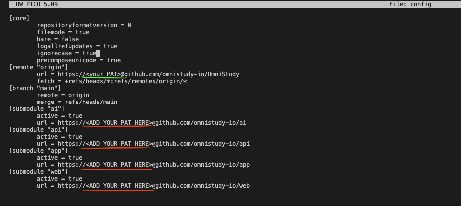
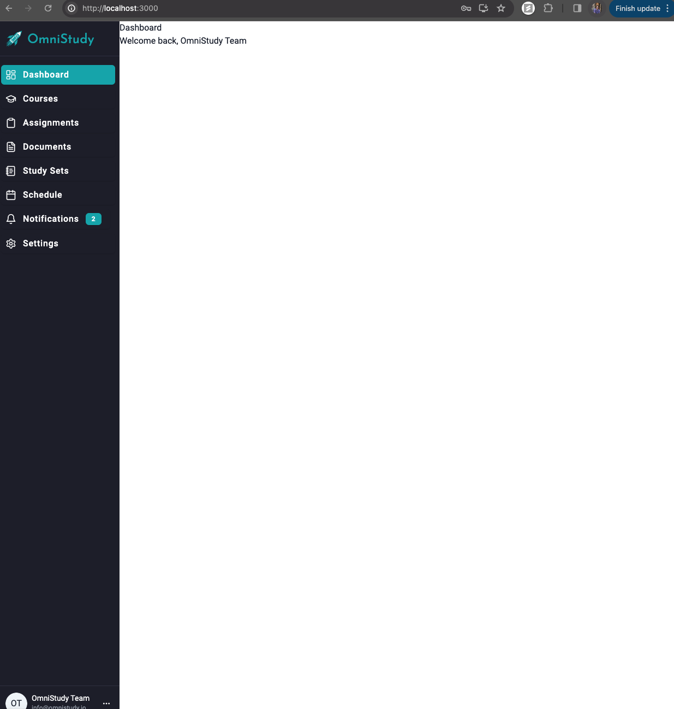

# Setting Up Your Dev Environment

## Preqrequisites
* Node.js/NPM
* Docker Desktop
* DBeaver
* Postman

## Cloning The Repository
Step 0: Generate a Personal Access Token from GitHub

Then, clone the repository with the following command
```bash
git clone https://<your PAT>@github.com/omnistudy-io/OmniStudy
```
Update the submodule config by adding your PAT before the repository URL similarily to how you cloned the repo
```bash
cd .git
nano config
```

Then, pull from the submodules from the root directory
```bash
git submodule update --init --recursive
```

## Running The Platform
From the root directory, run
```bash
docker-compose up -d
```
This will start the Docker containers (can take a minute). 

## Setting Up MySQL
Open Docker Desktop and click into the container named "omnistudy". Then click the three dots next to the "db" container and select "View Details". Look throughout the log files to find a line that says "GENERATED ROOT PASSWORD: {your password}". Then, select the "Exec: tab at the top of the screen and run the following command
```bash
mysql -u root -p
```
Enter the password you found in the logs and you should be in the MySQL shell.

Next, find the file `init.sql` located in `api/src/db`. Copy and paste the entire contents of this file into the MySQL shell and press enter. You should get no errors.

## Testing The Setup
Open DBeaver and create a new connection to MySQL. Use the following settings:
* Host: localhost
* Port: 3306
* User: root
* Password: testing

Open the dropdowns on the left hand side omnistudy > Databases > omnistudy > Tables. Double click on the `users` table and verify there is one row with an id `1` and username `omnistudy`.

Next, open Postman and run the request in API > users > Get user by id. You should get a response with the user you just verified in DBeaver.

Finally, open your browser and navigate to `localhost:3000`. You should see the OmniStudy login page. Login with the credentials (select the Remember Me button):
* Username: omnistudy
* Password: test

You should now be able to see the application.
